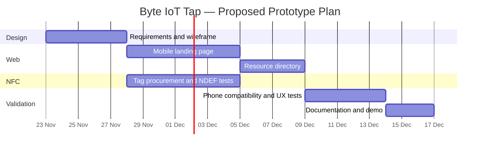

# Byte IoT Tap — Proposed 4-Week Gantt

```mermaid
gantt
  title Byte IoT Tap — Proposed Prototype Plan
  dateFormat YYYY-MM-DD
  axisFormat %d %b
  section Design
  Requirements and wireframe :a, 2026-11-23, 5d
  section Web
  Mobile landing page :b, after a, 7d
  Resource directory :c, after b, 4d
  section NFC
  Tag procurement and NDEF tests :d, 2026-11-28, 7d
  section Validation
  Phone compatibility and UX tests :e, 2026-12-09, 5d
  Documentation and demo :f, after e, 3d
```

Dates are a planning baseline, not proof of completion.
