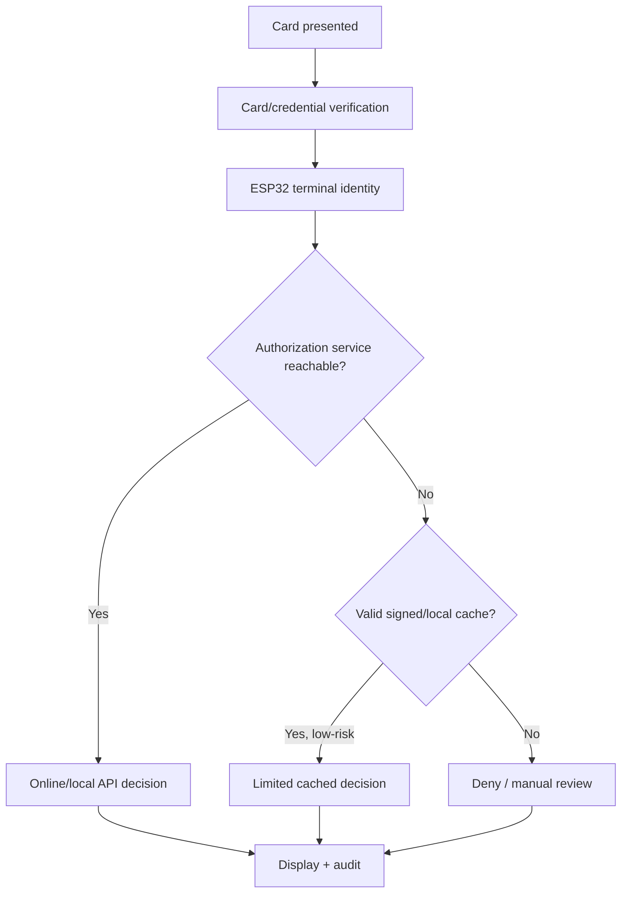

# Byte IoT Access — Architecture & Offline Flow

```mermaid
flowchart TD
  TAP["Card presented"] --> AUTH["Card/credential verification"]
  AUTH --> EDGE["ESP32 terminal identity"]
  EDGE --> NET{"Authorization service reachable?"}
  NET -->|Yes| API["Online/local API decision"]
  NET -->|No| CACHE{"Valid signed/local cache?"}
  CACHE -->|Yes, low-risk| LIMITED["Limited cached decision"]
  CACHE -->|No| DENY["Deny / manual review"]
  API --> DISPLAY["Display + audit"]
  LIMITED --> DISPLAY
  DENY --> DISPLAY
```

## Offline principle
Offline mode is bounded, role-specific and time-limited. A stale terminal must not claim real-time revocation knowledge.
