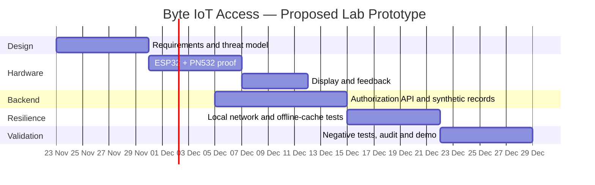

# Byte IoT Access — Proposed 6-Week Gantt

```mermaid
gantt
  title Byte IoT Access — Proposed Lab Prototype
  dateFormat YYYY-MM-DD
  axisFormat %d %b
  section Design
  Requirements and threat model :a, 2026-11-23, 7d
  section Hardware
  ESP32 + PN532 proof :b, 2026-11-30, 7d
  Display and feedback :c, after b, 5d
  section Backend
  Authorization API and synthetic records :d, 2026-12-05, 10d
  section Resilience
  Local network and offline-cache tests :e, 2026-12-15, 7d
  section Validation
  Negative tests, audit and demo :f, 2026-12-22, 7d
```
